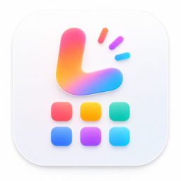

<p align="center">
  
</p>

<h1 align="center">Launcheer</h1>

Launcheer is a native macOS Launchpad-style application launcher.

它的目标很直接：在 macOS 新版本取消传统 Launchpad 后，提供一个尽量接近原版体验的轻量替代品。Launcheer 会覆盖当前桌面显示应用网格，但不进入 macOS 原生全屏 Space，并保留 Dock 和菜单栏。

Repository: [github.com/hitamio/launcheer](https://github.com/hitamio/launcheer)

## Features

- Launchpad-like app grid with a 5 x 7 layout.
- Translucent blurred background with dimming, keeping the current desktop context visible.
- Opens as an overlay on the current desktop instead of a native fullscreen Space.
- Click the blank background to hide.
- Search by app name or bundle identifier.
- Two-finger swipe paging with damped interactive movement.
- Clickable page indicators and hover-only page arrows.
- Drag to reorder apps.
- Drag apps together to create folders.
- Drag apps out of folders.
- Editable folder names.
- Full-screen folder view inspired by Launchpad.
- Long press to enter edit mode; icons wiggle and removable apps show a close button.
- App removal uses macOS Trash behavior when possible; protected apps can be revealed in Finder.
- Keyboard and controller navigation:
  - Arrow keys / D-pad / left stick to move selection.
  - Return / controller A to confirm.
  - Esc / controller B to go back or hide.
  - Moving past a row edge can turn pages.
- Remembers the last page.
- Automatically refreshes when apps are installed or removed.
- Optional global shortcut for show/hide.
- Optional main-display-only mode.
- App menu with Settings and About.
- Multi-language UI with in-app language selection.

## Languages

Launcheer supports:

- Follow System
- 简体中文
- 繁體中文
- English
- 日本語
- 한국어
- Español
- བོད་ཡིག (རྒྱ་ནག)

## Requirements

- macOS 14.0 or later
- Xcode Command Line Tools
- Swift 6 toolchain

The project is a Swift Package that builds a native AppKit/SwiftUI macOS app.

## Build

Build a release app bundle:

```sh
./scripts/build_app.sh
```

The generated app is written to:

```text
dist/Launcheer.app
```

Open it:

```sh
open ./dist/Launcheer.app
```

For development:

```sh
swift run
```

## Release DMG

This repository includes a GitHub Actions workflow at:

```text
.github/workflows/release.yml
```

It builds `dist/Launcheer.app`, packages it as a compressed DMG, calculates a SHA-256 checksum, and uploads both files to a GitHub Release.

Create a release by pushing a version tag:

```sh
git tag v0.1.0
git push origin v0.1.0
```

The workflow publishes:

```text
Launcheer-0.1.0.dmg
Launcheer-0.1.0.dmg.sha256
```

You can also run the workflow manually from GitHub Actions with a tag input such as `v0.1.0`.

The build script applies an ad-hoc signature by default so the app bundle is structurally signed:

```sh
./scripts/build_app.sh
codesign --verify --deep --strict ./dist/Launcheer.app
```

Ad-hoc signing is not the same as Developer ID signing. Apps downloaded from GitHub may still be blocked by Gatekeeper until the project is signed with a Developer ID certificate and notarized by Apple.

For local personal builds, running from `dist/Launcheer.app` avoids the browser download quarantine path:

```sh
open ./dist/Launcheer.app
```

### Developer ID signing and notarization

To produce a DMG that passes Gatekeeper for public distribution, create a `Developer ID Application` certificate in your Apple Developer account, export it as a `.p12`, and configure these GitHub Actions secrets:

```text
MACOS_CERTIFICATE_P12_BASE64
MACOS_CERTIFICATE_PASSWORD
KEYCHAIN_PASSWORD
APPLE_ID
APPLE_TEAM_ID
APPLE_APP_SPECIFIC_PASSWORD
```

`MACOS_CERTIFICATE_P12_BASE64` can be generated locally:

```sh
base64 -i DeveloperIDApplication.p12 | pbcopy
```

`APPLE_APP_SPECIFIC_PASSWORD` is an app-specific password for the Apple ID used with `notarytool`.

When these secrets are present, the release workflow will:

1. Import the Developer ID certificate into a temporary keychain.
2. Sign `Launcheer.app` with hardened runtime and timestamp.
3. Create and sign the DMG.
4. Submit the DMG to Apple's notary service with `xcrun notarytool`.
5. Staple and validate the notarization ticket.

Without these secrets, the workflow still creates an ad-hoc signed DMG for local testing.

## Settings

Open Settings from the app menu or the gear button in the launcher.

Available settings:

- Language selection.
- Show only on the main display.
- Enable or disable the global show/hide shortcut.
- Record a custom shortcut.
- Restore the default shortcut.

Default shortcut:

```text
Option + Space
```

## App Scanning

Launcheer scans applications from:

- `/Applications`
- `/System/Applications`
- `/System/Applications/Utilities`
- `~/Applications`

It filters out common non-launcher items such as aliases, symlinks, helper apps inside bundles, background-only apps, Chrome web app shims, and uninstallers.

Apps are sorted by added time in ascending order on first layout migration. Manual drag-and-drop layout changes are preserved afterward.

## Removing Apps

In edit mode, removable apps show a close button.

Launcheer attempts to move apps to Trash using macOS APIs. Some apps under `/Applications` may be protected by permissions or owned by `root`. In that case, Launcheer shows a Finder prompt so you can reveal the app and remove it through Finder, where macOS can request authorization.

System apps under `/System/Applications` are not removable from Launcheer.

## Notes

- This project is inspired by macOS Launchpad, but it is not affiliated with Apple.
- The UI intentionally avoids entering a native fullscreen Space.
- The app is currently optimized for personal/local use and active iteration.

## License

No license has been declared yet.
